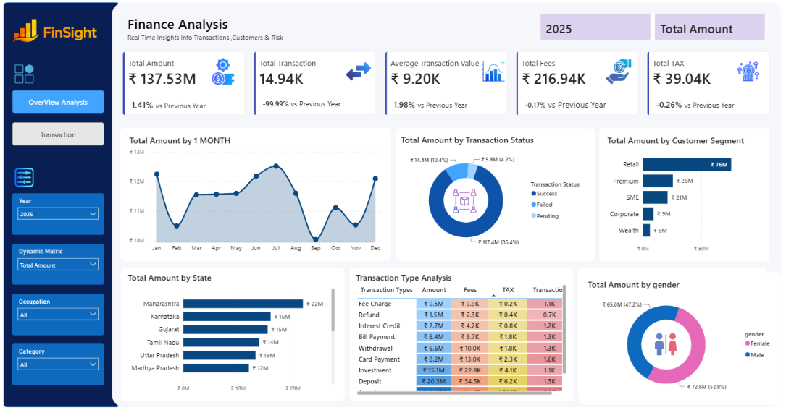

# 📊 Finance Analysis Dashboard - Power BI

## Overview
This project is an interactive Finance Analysis Dashboard developed using Power BI to analyze and visualize financial data. The dashboard provides insights into revenue, expenses, profit, and overall business performance through dynamic visualizations, KPI tracking, and trend analysis.

## Features
- Revenue Analysis
- Profit Analysis
- Expense Tracking
- KPI Cards for Key Metrics
- Interactive Filters and Slicers
- Monthly & Yearly Trend Analysis
- Dynamic Charts and Visualizations
- User-Friendly Dashboard Design

## Tools & Technologies
- Power BI
- Power Query
- DAX (Data Analysis Expressions)
- Excel / CSV Dataset

## Dashboard Components
- Total Revenue
- Total Expenses
- Total Profit
- Profit Margin
- Financial Trends
- Category-wise Performance Analysis
- Interactive Slicers

## Project Workflow
1. Data Collection
2. Data Cleaning & Transformation
3. Data Modeling
4. DAX Measure Creation
5. Dashboard Development
6. Insight Generation

## Key Insights
- Track overall financial performance.
- Monitor revenue and profit trends.
- Analyze expense distribution.
- Identify high-performing business segments.
- Support data-driven decision-making.

## Skills Demonstrated
- Data Cleaning
- Data Transformation
- Data Modeling
- DAX Calculations
- Data Visualization
- Business Intelligence Reporting
- Dashboard Design

## Dashboard Preview
Add your dashboard screenshot here:

## Future Enhancements
- Financial Forecasting
- Advanced KPI Metrics
- Automated Data Refresh
- Drill-Through Reports
- Mobile-Friendly Dashboard

## Author
Atharv  
Electronics & Computer Engineering Student

⭐ If you found this project useful, feel free to star the repository.